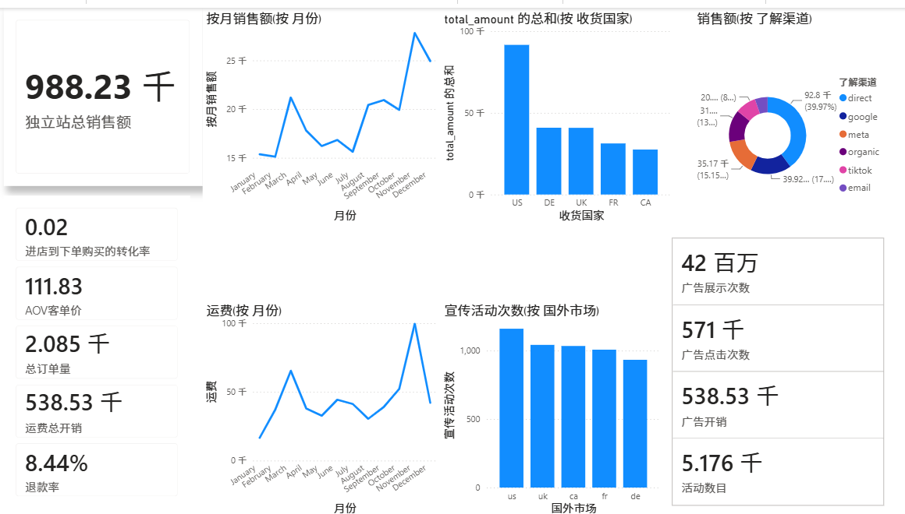

# 项目优化建议清单

## 📋 当前状态评估

### ✅ 已完成的核心内容
- 完整的中英双语 README
- 3 个核心分析模块的专业报告
- PowerBI 可视化截图
- 详细的简历呈现建议
- 面试准备指南
- Git 配置文件（.gitignore, LICENSE）

### 🔄 建议优化的部分

---

## 1. 代码组织优化（可选，但推荐）

### 当前问题
- Python 代码都在 `pythonProject1/` 目录下
- 目录名称不够专业（pythonProject1）
- 缺少代码注释

### 优化方案

#### 方案 A：轻量级优化（30分钟）
只调整目录结构，代码保持原样：

```bash
# 重命名目录
cd /e/data-analysis-two
mv pythonProject1 src_backup

# 创建新的 src 目录
mkdir -p src

# 复制核心脚本到 src/
cp src_backup/data_generator.py src/
cp src_backup/data_cleaning.py src/
cp src_backup/attribution_budget_analysis.py src/
cp src_backup/cart_abandonment_analysis.py src/
cp src_backup/rfm_segmentation_analysis.py src/
cp src_backup/cohort_retention_prep.py src/

# 在 README 中更新路径说明
```

#### 方案 B：完整优化（2-3小时）
重构代码，添加注释和文档字符串：
- 添加函数文档字符串（docstring）
- 统一代码风格（PEP 8）
- 提取公共函数到 `utils.py`
- 添加配置文件 `config.py`

**建议**：如果时间紧张，先用方案 A，后续有空再完善。

---

## 2. 数据文件处理

### 当前状态
- 数据文件在 `pythonProject1/data/` 和 `pythonProject1/data_cleaned/`
- PowerBI 文件（1.pbix）约 30MB

### 优化方案

#### 选项 1：不上传数据（推荐）
**优点**：仓库轻量，加载快
**做法**：
```bash
# 在 .gitignore 中添加
echo "pythonProject1/data/*.csv" >> .gitignore
echo "pythonProject1/data_cleaned/*.csv" >> .gitignore
echo "powerBI/*.pbix" >> .gitignore
```

**在 README 中说明**：
```markdown
## 📊 数据说明

由于数据文件较大，未上传至 GitHub。你可以：
1. 运行 `python src/data_generator.py` 生成模拟数据
2. 或从 [百度网盘/Google Drive] 下载完整数据（可选）
```

#### 选项 2：上传部分数据
保留一个小的示例数据集（如 1000 行）供展示：
```bash
# 创建示例数据
head -n 1001 pythonProject1/data/orders.csv > data/sample/orders_sample.csv
```

---

## 3. 可视化增强（可选）

### 当前状态
- 只有 PowerBI 静态截图
- 缺少交互式可视化

### 优化方案

#### 快速方案：添加图表说明
在 README 中每个截图下方添加文字说明：

```markdown
### 经营总览仪表板


**核心指标**：
- 独立站总销售额：988.23K
- 整站转化率：0.02%
- 平均客单价：$111.83
- 销售额 Top 市场：US ($100K+)
```

#### 进阶方案：创建交互式 HTML 仪表板
使用 Plotly 重现关键图表（需 2-4 小时）：
- 创建 `create_dashboards.py` 脚本
- 生成 HTML 文件到 `dashboards/`
- 可以部署到 GitHub Pages

**建议**：先上传静态版本，后续有空再添加交互式版本。

---

## 4. 文档完善

### 建议添加的内容

#### 4.1 快速开始指南（Quick Start）
在 README 中添加更详细的步骤：

```markdown
## 🚀 5分钟快速体验

### 步骤 1：安装依赖
\```bash
pip install -r requirements.txt
\```

### 步骤 2：生成数据
\```bash
cd src
python data_generator.py
\```
预计耗时：2-3 分钟

### 步骤 3：运行分析
\```bash
python attribution_budget_analysis.py
\```

### 步骤 4：查看结果
打开 `outputs/reports/` 查看分析报告
```

#### 4.2 常见问题（FAQ）
创建 `docs/FAQ.md`：
- 数据是真实的吗？
- 如何修改数据生成参数？
- 模型预测结果准确吗？
- 可以用在真实业务吗？

#### 4.3 贡献指南（可选）
如果希望其他人参与改进：
- 创建 `CONTRIBUTING.md`
- 说明如何提交 Issue 和 PR

---

## 5. 简历和作品集优化

### 5.1 准备多个版本的项目描述

**30字极简版**（简历一行）：
> 跨境电商全链路分析：多触点归因、CLV预测、流失预警（Python/PowerBI）

**100字简洁版**（简历项目栏）：
> 模拟跨境DTC品牌180K用户数据，完成广告归因、转化漏斗、用户LTV三大分析。发现Meta渠道被低估23%，购物车放弃率78.63%，使用BG/NBD模型预测CLV，LightGBM构建流失预警（AUC 0.84）。

**300字完整版**（作品集网站）：
> 见 `docs/resume-highlights.md`

### 5.2 准备演示材料

#### 必备材料
- [x] GitHub 仓库链接
- [x] 项目 README
- [x] 核心可视化截图

#### 加分材料（可选）
- [ ] 3-5 分钟视频讲解（录屏 + 配音）
- [ ] PPT 演示文稿（5-10 页）
- [ ] 一页纸项目总结（PDF）

---

## 6. 上传前最终检查

### 文件大小检查
```bash
# 检查大文件（超过 10MB）
cd /e/data-analysis-two
find . -type f -size +10M -not -path "./.git/*"

# 如果有大文件，添加到 .gitignore
```

### 敏感信息检查
```bash
# 搜索可能的敏感信息
grep -r "password" .
grep -r "api_key" .
grep -r "secret" .
```

### Markdown 格式检查
在 GitHub 上传前，先在本地预览 README：
- 使用 VSCode 的 Markdown Preview
- 或使用在线工具：https://dillinger.io/

### 链接有效性检查
检查 README 中的所有链接：
- 内部文档链接（相对路径）
- 图片路径
- 外部引用链接

---

## 7. 时间预算建议

### 立即上传版本（1小时）
- [x] 当前状态已可上传
- [ ] 只需补充 30 分钟：整理 .gitignore，排除大文件
- [ ] 30 分钟：在 GitHub 创建仓库并推送

### 优化版本（3-5小时）
- [ ] 1 小时：整理代码结构，移动到 src/
- [ ] 1 小时：添加代码注释
- [ ] 1-2 小时：创建 Jupyter Notebook 示例
- [ ] 1 小时：优化 README，添加更多说明

### 完美版本（1-2天）
- [ ] 上述所有内容
- [ ] 创建交互式 Plotly 仪表板
- [ ] 录制项目讲解视频
- [ ] 制作演示 PPT
- [ ] 创建个人作品集网站

---

## 🎯 推荐行动路径

### 阶段 1：立即上传（今天完成）

```bash
# 1. 清理大文件
cd /e/data-analysis-two
echo "pythonProject1/data/*.csv" >> .gitignore
echo "pythonProject1/data_cleaned/*.csv" >> .gitignore
echo "powerBI/1.pbix" >> .gitignore

# 2. 提交并推送
git add .
git commit -m "feat: 初始化项目"
git remote add origin YOUR_GITHUB_URL
git push -u origin main
```

### 阶段 2：基础优化（本周完成）
1. 整理代码目录结构
2. 添加代码注释
3. 补充 README 的"快速开始"部分

### 阶段 3：持续完善（有空再做）
1. 创建 Jupyter Notebook
2. 制作交互式仪表板
3. 录制项目讲解视频

---

## 📊 优先级矩阵

| 任务 | 重要性 | 紧急性 | 耗时 | 建议 |
|------|--------|--------|------|------|
| 上传到 GitHub | ⭐⭐⭐⭐⭐ | ⭐⭐⭐⭐⭐ | 1h | 立即执行 |
| 清理 .gitignore | ⭐⭐⭐⭐ | ⭐⭐⭐⭐ | 15min | 立即执行 |
| 整理代码结构 | ⭐⭐⭐ | ⭐⭐⭐ | 1h | 本周完成 |
| 添加代码注释 | ⭐⭐⭐ | ⭐⭐ | 2h | 本周完成 |
| Jupyter Notebook | ⭐⭐⭐ | ⭐⭐ | 3h | 有空再做 |
| 交互式仪表板 | ⭐⭐ | ⭐ | 4h | 有空再做 |
| 录制讲解视频 | ⭐⭐ | ⭐ | 2h | 有空再做 |

---

## ✅ 最终建议

**你现在就可以上传了！** 

当前项目已经具备：
- ✅ 完整专业的文档
- ✅ 详细的分析报告
- ✅ 清晰的可视化展示
- ✅ 面试准备材料

这已经是一个**非常完整的作品集项目**了。

**建议行动**：
1. **今天**：按照 `GITHUB_UPLOAD_GUIDE.md` 上传到 GitHub
2. **本周**：根据本文档"阶段 2"进行基础优化
3. **有空时**：慢慢完善"阶段 3"的进阶内容

不要追求完美而拖延上传，**先上传 80 分的版本，再慢慢迭代到 100 分**。

祝你求职顺利！🚀
